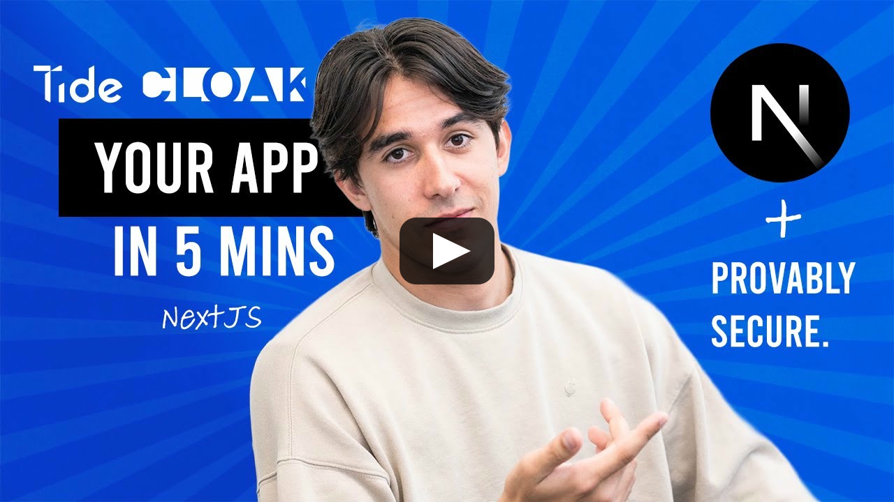

# Quickstart TideCloak App

This developer-oriented guide will take you through the minimal steps to set up a development environment with a fully-functional TideCloak server, and build your first very-own Client-Server NextJS web application, secured with TideCloak - **all in 5 minutes**.

> 📖 This guide is also available on the [TideCloak docs site](<https://docs.tide.org/get-started/Tidecloak%20Quickstart>).

[](https://www.youtube.com/watch?v=dVpDUF_XJdw)

---

## Prerequisites

<details>
<summary><b>Docker</b> installed and running</summary>

Here's an example on how to set up Docker on Debian 12 linux environment:

```bash
for pkg in docker.io docker-doc docker-compose podman-docker containerd runc; do sudo apt-get remove -y $pkg; done

sudo apt-get update

sudo apt-get install -y ca-certificates curl gnupg

sudo install -m 0755 -d /etc/apt/keyrings

curl -fsSL https://download.docker.com/linux/debian/gpg | sudo tee /etc/apt/keyrings/docker.asc > /dev/null

sudo chmod a+r /etc/apt/keyrings/docker.asc

echo "deb [arch=$(dpkg --print-architecture) signed-by=/etc/apt/keyrings/docker.asc] https://download.docker.com/linux/debian $(. /etc/os-release && echo "$VERSION_CODENAME") stable" | sudo tee /etc/apt/sources.list.d/docker.list > /dev/null

sudo apt-get update

sudo apt-get install -y docker-ce docker-ce-cli containerd.io docker-buildx-plugin docker-compose-plugin
```

</details>

<details>
<summary><b>Node.js</b>, <b>curl</b> and <b>jq</b> installed and updated</summary>

Here's an example on how to install Node NPM on Debian 12 linux environment:

```bash
curl -fsSL https://deb.nodesource.com/setup_lts.x | sudo -E bash -

sudo apt-get install -y nodejs curl jq

sudo npm install -g npm@latest
```

</details>

<details>
<summary><b>Internet</b> connectivity</summary>

Yeah... You'll have to sort it out yourself.

</details>

---

## 1. Start TideCloak in Dev Mode

Run a pre-configured Dev container:

```bash
sudo docker run \
  --name mytidecloak \
  -d \
  -v .:/opt/keycloak/data/h2 \
  -p 8080:8080 \
  -e KC_BOOTSTRAP_ADMIN_USERNAME=admin \
  -e KC_BOOTSTRAP_ADMIN_PASSWORD=password \
  tideorg/tidecloak-dev:latest
```

<details>
<summary>You don't need to worry about changing any of these settings</summary>

But if you want, here's what those settings are for:

* `--name`: setting name for the server
* `-d`: run in the background
* `-v`: map the database to local folder to make it persistant
* `-p 8080:8080`: map host port
* `KC_BOOTSTRAP_ADMIN_[USERNAME | PASSWORD]`: set admin credentials

</details>

After few seconds, you'll be able to access the tide-console for your realm at `http://localhost:8080/realms/{realm}/tide-console/`.

### Optional: Check TideCloak console logs

```bash
sudo docker logs mytidecloak -f
```

---

## 2. Initialize the template project

The initializer will automatically create the realm and clients on your TideCloak server. This includes the Tide IdP, license activation, first admin assignment and Quorum-Enforced Governance enablement.

```bash
npm init @tidecloak/nextjs@latest my-app
```

Simply follow the instructions and use defaults if unsure.

---

## 3. Build and run the app

```bash
cd my-app

npm install

npm run dev
```

---

## 4. Have a play 🎉

Access your app on [http://localhost:3000](http://localhost:3000)

---

**Done!** You've just deployed a TideCloak Dev server, activated your license, created and assigned the main admin, built and deployed your first TideCloak-protected app - and all in 5 minutes.

You can find more information on this project's [Github repo](https://github.com/tide-foundation/tidecloak-js/tree/main/packages/tidecloak-create-nextjs#expanding-from-the-template) page.
